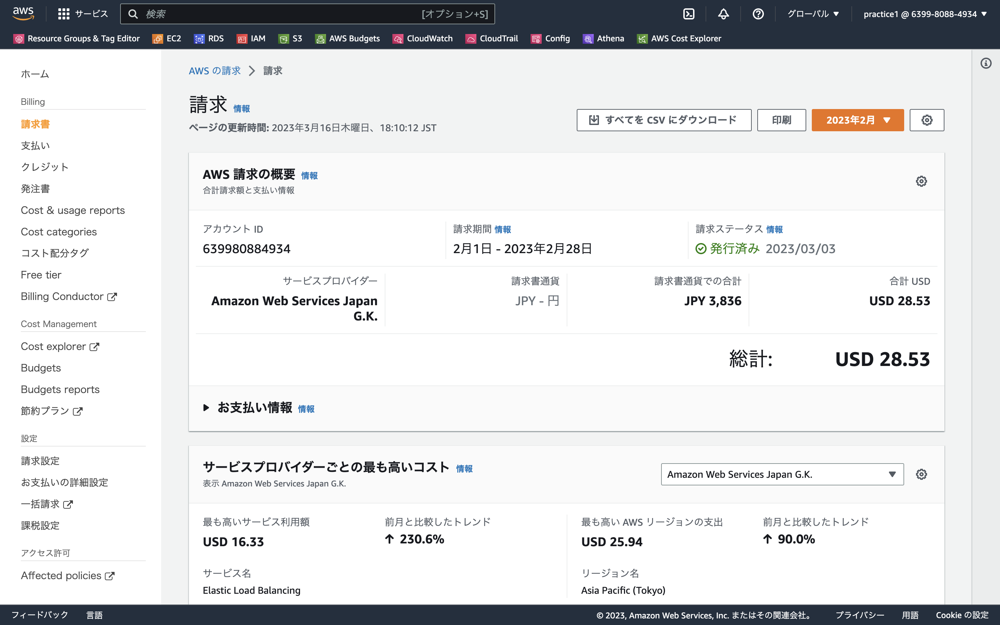

# **第6回課題提出**

## **CloudTrailのイベントの中にはどんな情報が含まれていますか?**
 
StartInstances 
イベント時間：March 16, 2023, 18:58:33 (UTC+09:00) 
リソースタイプ：AWS::EC2::Instance 
AWS リージョン：ap-northeast-1 
 
StartDBInstance 
イベント時間：March 16, 2023, 18:58:10 (UTC+09:00) 
リソースタイプ：AWS::RDS::DBInstance 
AWS リージョン：ap-northeast-1 
 

---
## **CloudWatchアラームの設定とメール通知**
 

### **ALBのUnHealthy、アラーム設定とメール通知**
>Railsアプリケーションを使えない状態にすると、 コンソールの表示がアラーム状態となり、アラームメールが通知されました。
  
  

 

### **ALBのHealthy、OKアクション設定とメール通知**
>Railsアプリケーションを使える状態にすると、 コンソールの表示がOK状態となり、OKメールが通知されました。
  
  

 

---
## **AWS利用料の見積を作成してください。**

>見積りURL：
https://calculator.aws/#/estimate?id=04bda927bcef046814b42d287ab2559cfc3a14cb

 

---
## **マネジメントコンソールから、現在の利用料を確認して教えてください。**

  
 

---
## **先月の請求情報から、EC2 の料金がいくらか確認してください。**

  
 

---
## **無料利用枠で収まっていますか？**

  

> 無料枠の期限が切れているため、無料利用枠で収まっていません。
 

---
## **今回の課題から学んだこと**
>今回の作業を通して、ログを取って調べる事、監視して通知する事は 重要な事だと学びました。 
今回触れなかったサービスや機能も理解できる様、学習を続けたいと思いました。
