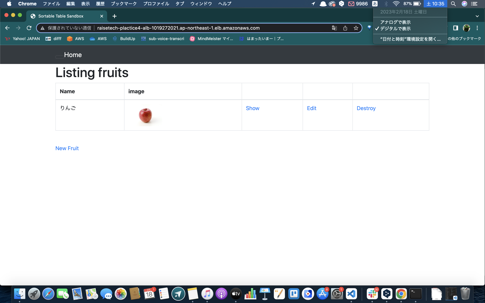

# 第5回課題提出

- 組み込みサーバー Pumaでの起動
    

- Pumaでのブラウザ接続
    

- Nginxの起動
    

- Unicornの起動
    

- ELBの追加
    

    

- ターゲットグループのヘルスチェック
    

- S3の追加
    

    

    
 
- 構成図

    
 
## 今回の課題でつまずいたポイント  
  - OpenSSL::Cipher::CipherErrorの解決
    - credentials.yml.encとmaster.keyを一旦削除し、再度作り直す事で解決しました。 credentials.yml.encとmaster.keyの組み合わせについて調べた事で、鍵の仕組みについて理解が深まりました。
       
    -  環境変数を反映するには、一旦ログアウトしないといけない事に気付くまで、時間がかかってしまいました。 
       
  - S3作成後のCORSエラー(No 'Access-Control-Allow-Origin')
    - S3のCORS設定をJSON形式でアクセスを許可できるように追記しました。  オリジンとクロスオリジン、ヘッダーなど、リソース共有の仕組みについて理解が深まりました。 
       
## 今回の課題から学んだこと
- エラーコードをしっかり読んで、仮説と検証をする大切さを再確認しました。 

- 今回の課題は提出できるまで、かなり時間をかけてしまった。 ただ、行った事を思い出せるように、メモを取りながら作業したため、スムーズに作業を再開できた点は良かったと思います。 
 
## 課題
 -  エラーなどで詰まった際、仮説と検証に何日もかけてしまう事があった。 質問するまで、どの程度時間をかけるのか、自分で目安を決めた方が良いと思いました。
